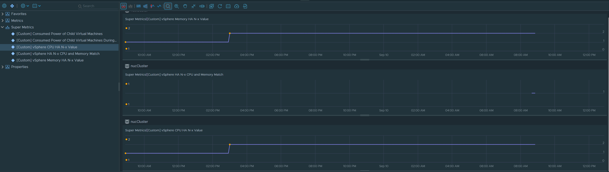

# vSphere HA N-x Supermetric JSON

This supermetric JSON contains three super metrics:

1. **CPU Failover** – calculates the vSphere N-x value for CPU failover based on the total host count and configured reserve percent.  
2. **Memory Failover** – calculates the vSphere N-x value for Memory failover based on the total host count and configured reserve percent.  
3. **Configuration Match** – returns `1` if the CPU and memory configuration match, or `0` if they do not.

---



---

### CPU Supermetric
```text
({
  This Resource: configuration|dasConfig|cpuFailoverPercent
} * {
  This Resource: summary|total_number_hosts
}) / 100
```

---

### Memory Supermetric
```text
({
  This Resource: configuration|dasConfig|memFailoverPercent
} * {
  This Resource: summary|total_number_hosts
}) / 100
```

---

### Do They Match?
```text
({
  This Resource: Super Metrics|[Custom] vSphere CPU HA N-x Value
} == {
  This Resource: Super Metrics|[Custom] vSphere Memory HA N-x Value
})
```
